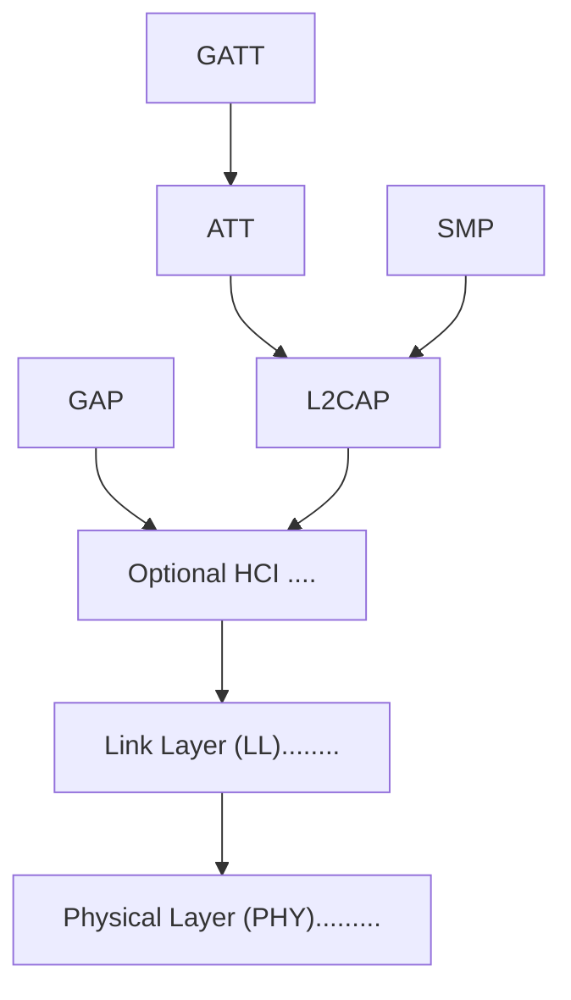

The GAP service is a GATT service, so reading or writing its characteristics
uses GATT over ATT. Core GAP procedures such as advertising, scanning, and
connection establishment use the Link Layer. HCI is the optional standard
interface between a separate host and controller; this project uses direct
hardware hooks instead.
