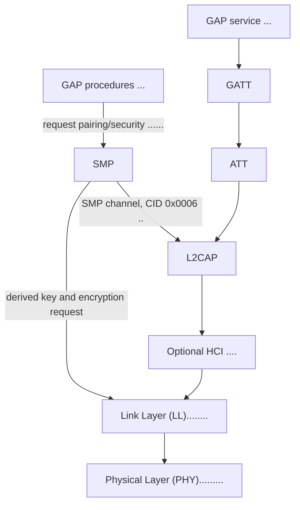

The GAP service is a GATT service, so reading or writing its characteristics
uses GATT over ATT and L2CAP. GAP security procedures can request pairing;
SMP exchanges pairing messages over L2CAP's fixed Security Manager channel
(CID 0x0006), then supplies the negotiated key for Link Layer encryption.
Advertising, scanning, and connection procedures also use the Link Layer. HCI
is the optional standard interface between a separate host and controller;
this project uses direct hardware hooks instead.
